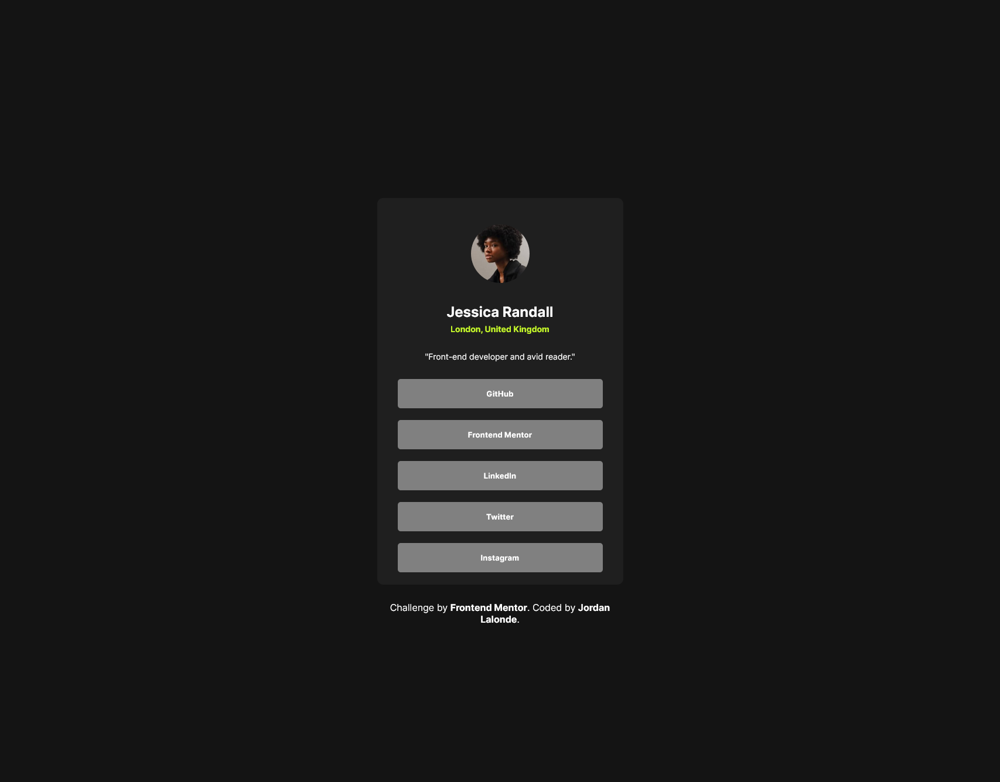

# Frontend Mentor - Social links profile solution

This is a solution to the [Social links profile challenge on Frontend Mentor](https://www.frontendmentor.io/challenges/social-links-profile-UG32l9m6dQ). Frontend Mentor challenges help you improve your coding skills by building realistic projects.

## Table of contents

- [Overview](#overview)
  - [The challenge](#the-challenge)
  - [Screenshot](#screenshot)
  - [Links](#links)
  - [Built with](#built-with)
  - [What I learned](#what-i-learned)
  - [Continued development](#continued-development)

## Overview

### The challenge

Users should be able to:

- See hover and focus states for all interactive elements on the page

### Screenshot

### Links
- Live Site URL: https://jbrunetlalonde.github.io/social-links-profile/

### Built with

- Semantic HTML5 markup
- CSS custom properties
- Flexbox

### What I learned

I continued to learn how to use flexbox and other css properties. I practice to clean my code and add more classes to have a cleaner experience.

### Continued development

I want to keep focusing on cleaning my code.
